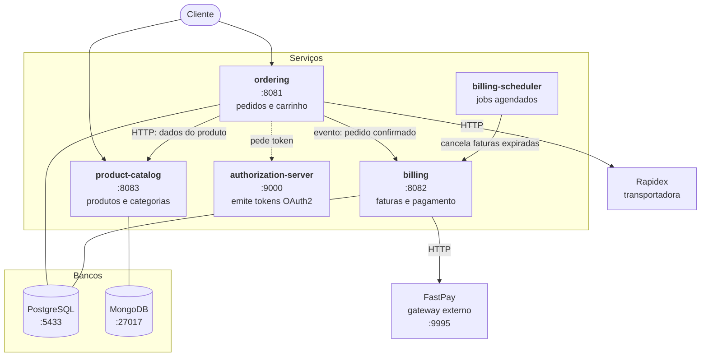

# Arquitetura do AlgaShop

> Visão macro: quais são os serviços, por que estão separados assim, e como conversam entre si.

---

## O sistema

O AlgaShop é um e-commerce decomposto em quatro microsserviços, cada um com banco próprio e ciclo de deploy independente — mais um **authorization server**, que não é de negócio: ele existe para emitir credencial.



---

## Os serviços

### `algashop-ordering` — o coração do domínio

Carrinho de compras, pedidos, clientes, checkout. É o serviço mais maduro e onde a maior parte dos conceitos de DDD foi exercitada: agregados, value objects, domain events, specifications, domain services.

| | |
|---|---|
| **Porta** | 8081 |
| **Banco** | PostgreSQL (`ordering`) |
| **Arquitetura** | Hexagonal — `core/` (domínio + aplicação + ports) e `infrastructure/` (adapters) |
| **Destaques** | DDD tático, CQRS com Criteria API, domain events, Flyway |
| **Pacote** | `com.gtech.algashop` |

```
core/
├── domain/model/        agregados, value objects, domain services
├── application/         casos de uso
└── ports/
    ├── in/              o que a aplicação OFERECE
    └── out/             o que a aplicação PRECISA
infrastructure/
├── adapters/in/web      controllers REST, listeners
├── adapters/out/        persistência JPA, notificações
└── config/
```

> [`ports-hexagonal.md`](../01-arquitetura-design/ports-hexagonal.md) · [`cqrs.md`](../01-arquitetura-design/cqrs.md) · [`specification.md`](../01-arquitetura-design/specification.md)

### `algashop-billing` — cobrança

Faturas e integração com gateway de pagamento. É o serviço que mais ensina sobre **falar com o mundo externo**: o FastPay pode estar fora do ar, pode demorar, pode recusar o cartão.

| | |
|---|---|
| **Porta** | 8082 |
| **Banco** | PostgreSQL (`billing`) |
| **Destaques** | Integração FastPay, WireMock, contract tests, Testcontainers |
| **Pacote** | `com.algaworks.algashop.billing` |

A infraestrutura de pagamento tem duas implementações — `payment/fastpay/` (real) e `payment/fake/` (para desenvolvimento e testes). Trocar uma pela outra é questão de configuração, e é a razão prática de existir uma abstração ali.

> [`stubs-contract-tests.md`](../03-testes-integracao/stubs-contract-tests.md)

### `product-catalog` — catálogo

Produtos e categorias. O único serviço em MongoDB — e a razão é o padrão de acesso: muito mais leitura que escrita, atributos que variam por tipo de produto, nenhuma transação com dinheiro.

> 🔧 **A última parte dessa justificativa envelheceu, e de um jeito interessante.** "Nenhuma transação com dinheiro" continua verdade — o catálogo não cobra ninguém. Mas na Fase 14 o serviço passou a precisar de transação assim mesmo, para que o ajuste de estoque e o registro da movimentação caíssem juntos. A lição é que **"não preciso de transação" raramente é propriedade do domínio; costuma ser propriedade da modelagem atual dele.** Bastou uma segunda coleção para a premissa mudar. Ver [`transacoes-mongo.md`](../02-persistencia/transacoes-mongo.md).

| | |
|---|---|
| **Porta** | 8083 |
| **Banco** | MongoDB — replica set `rs0` de três nós (`product_catalog`) |
| **Destaques** | Modelagem documental e desnormalização, eventos de domínio, concorrência atômica, transação multi-coleção, Spring Boot 4, REST Docs, contract-driven development |
| **Pacote** | `com.algaworks.algashop.product.catalog` |

> [`product-catalog-mongo.md`](../02-persistencia/product-catalog-mongo.md) · [`desnormalizacao-mongo.md`](../02-persistencia/desnormalizacao-mongo.md) · [`concorrencia-e-atomicidade.md`](../02-persistencia/concorrencia-e-atomicidade.md) · [`eventos-e-listeners.md`](../01-arquitetura-design/eventos-e-listeners.md) · [`tratamento-erros-api.md`](../03-testes-integracao/tratamento-erros-api.md)

### `authorization-server` — quem emite credencial

O único serviço sem domínio de negócio. Ele não tem banco, não tem entidade, e quase não tem código: uma dependência do Spring Authorization Server e dois clientes declarados em YAML produzem os seis endpoints do protocolo OAuth 2.1.

Ele está separado pela mesma razão que os outros: **emitir credencial e verificar credencial são responsabilidades diferentes**. Concentrar a emissão num serviço significa que o segredo mora num lugar só, e que acrescentar um microsserviço não acrescenta mais um lugar que precisa saber validar senha.

> ⚠️ **Nenhum dos outros serviços exige token ainda.** A seta pontilhada no diagrama é a intenção, não o estado atual — não há resource server configurado. Ver [`authorization-server.md`](../05-seguranca/authorization-server.md).

### `billing-scheduler` — jobs agendados

O menor dos quatro. Cancela faturas expiradas periodicamente. Existe separado do `billing` de propósito: job agendado e API REST têm perfis de escala completamente diferentes — um roda de vez em quando e pode ser pesado, o outro precisa responder rápido o tempo todo.

> [`scheduled-jobs.md`](../04-infraestrutura/scheduled-jobs.md)

---

## Persistência poliglota

| Serviço | Banco | Por quê |
|---|---|---|
| `ordering` | PostgreSQL | Transações, invariantes fortes, dinheiro |
| `billing` | PostgreSQL | Idem — fatura errada é problema sério |
| `product-catalog` | MongoDB (replica set) | Leitura dominante, schema flexível, volume — e, desde a Fase 14, transação entre duas coleções |
| `product-catalog`, `ordering` | Redis | **Cache**, não banco: nada ali é exclusivo, e perder tudo custa misses, não dado |

O Redis é a exceção que confirma a regra do banco por serviço: ele é **compartilhado** pelos dois, em bancos lógicos separados (0 e 1). Isso é aceitável porque nenhum dos dois guarda ali informação que não exista em outro lugar — mas bancos lógicos separam namespace, não memória. Ver [`redis.md`](../04-infraestrutura/redis.md).

Isso só é possível porque **cada serviço é dono do seu banco**. Se dois serviços compartilhassem banco, mudar um schema quebraria o outro, e a independência de deploy iria embora.

> #### Nota de estudo: a regra tem uma exceção, e ela está no código
>
> Seria confortável escrever aqui que nenhum serviço lê a tabela do outro. Não é verdade: o **`billing-scheduler` acessa o banco do `billing` diretamente**, por SQL, sem passar pela API daquele serviço.
>
> ```sql
> select i.id, ps.gateway_code
> from invoice i
> inner join payment_settings ps on i.payment_settings_id = ps.id
> where i.expires_at <= now() - interval '1 days' and i.status = ?
> for update skip locked
> ```
>
> Ele lê **e escreve** — o `UPDATE` marca as faturas como `CANCELED`. O custo é concreto, e vale enumerar em vez de esconder:
>
> - contorna `Invoice.cancel()`, então a regra de negócio do agregado não é consultada
> - não dispara `InvoiceCanceledEvent` — quem escutaria esse evento não é avisado
> - o `UPDATE` não incrementa a coluna `version`, então o lock otimista do `billing` não enxerga a alteração
> - o schema do `billing` vira **contrato implícito**: renomear uma coluna lá quebra o scheduler sem que nada acuse
>
> O que se compra com isso é simplicidade: uma varredura em lote resolvida por uma consulta, com `FOR UPDATE SKIP LOCKED` permitindo várias instâncias concorrerem, em vez de N chamadas HTTP e um endpoint novo no `billing`.
>
> A alternativa correta seria o `billing` expor algo como `POST /invoices/expired/cancel` e o scheduler apenas disparar. Vale conhecer as duas pontas — e vale mais ainda perceber que **a regra "banco por serviço" costuma ser descrita como absoluta e quase sempre tem uma exceção assim**, que ninguém documenta.

> [`nosql-conceitos.md`](../02-persistencia/nosql-conceitos.md)

---

## Como os serviços conversam

### Chamada síncrona (HTTP)

`ordering` → `product-catalog` para buscar dados de produto ao montar um pedido.

O acoplamento aqui é real: se o catálogo cair, o pedido não é criado. O que reduz o risco é o **contrato explícito** — o `product-catalog` publica um contrato, e o `ordering` testa contra o stub gerado a partir dele. Nenhum dos dois precisa do outro de pé para rodar os testes.

Desde a Fase 15 há uma camada no meio: o `ordering` **cacheia a resposta** do catálogo por um TTL curto. Isso reduz a chamada de rede, e não reduz o acoplamento — um miss ainda depende do catálogo estar de pé. O que ele compra é fôlego, não independência. E vale saber o efeito colateral: o `ordering` não fica sabendo quando um produto muda no catálogo, então o TTL é a única invalidação possível. Ver [`cache.md`](../01-arquitetura-design/cache.md).

E desde a Fase 16 há mais uma: **timeout, retry, bulkhead e circuit breaker** em volta da chamada. O acoplamento continua exatamente o mesmo — se o catálogo cair, o pedido não é criado. **O que mudou foi como ele falha:** em vez de threads penduradas até o serviço inteiro parar, a falha vira `502` ou `504` em segundos, com no máximo 10 threads ocupadas.

A diferença entre as duas chamadas de saída do `ordering` merece ser dita aqui, porque é uma decisão de produto e não de infraestrutura:

| Chamada | Se a dependência cair |
|---|---|
| `ordering → product-catalog` | **falha** — 502/504, o pedido não é criado |
| `ordering → Rapidex` (frete) | **degrada** — devolve um frete estimado, e o cliente não sabe |

Não dá para inventar o preço de um produto; dá para estimar um frete. Ver [`resiliencia.md`](../01-arquitetura-design/resiliencia.md).

```
product-catalog  --define-->  contrato  --gera-->  stub
                                                     ↓
                                          ordering testa contra o stub
```

### Integração externa

`billing` → FastPay (pagamento), `ordering` → Rapidex (frete). Ambas mockadas por WireMock no ambiente local.

### O que ainda não existe

Mensageria (RabbitMQ/Kafka) entre serviços. Os eventos hoje são **internos ao processo** que os publica, em dois serviços:

| Onde | Como |
|---|---|
| `ordering` | domain events publicados e consumidos via `ApplicationEventPublisher` do Spring |
| `product-catalog` | o mesmo mecanismo, por **duas** portas de saída — `ApplicationMessagePublisher` (aplicação) e `DomainEventPublisher` (domínio) —, com o consumidor da categoria rodando `@Async` e os de estoque **dentro da transação** |

O `product-catalog` é o caso mais interessante dos dois, porque lá o evento não é acessório: ele é o que mantém a cópia desnormalizada da categoria em dia. Um evento perdido não é só uma notificação a menos — é dado desatualizado que ninguém corrige. Ver [`eventos-e-listeners.md`](../01-arquitetura-design/eventos-e-listeners.md).

É o próximo passo natural da evolução — e o que falta não é só o broker: retentativa, dead letter, ordem e reconciliação vêm junto.

---

## Artefatos de apoio

| Onde | O quê |
|---|---|
| [`../domain-diagram/`](../domain-diagram/) | Diagramas de domínio em PDF — `Ordering.pdf`, `Product&Catalog.pdf`, `billing.pdf` |
| [`../openapi/`](../openapi/) | Especificações OpenAPI — `ordering.yml`, `billing.yml`, `product-catalog.yml` |
| `etc/wiremock/` (no meta) | Stubs das APIs externas |
| `etc/stub-runner/` (no meta) | Runner dos stubs gerados pelos contract tests |

---

## Princípios que se repetem

Padrões que aparecem em mais de um serviço — vale reconhecê-los:

1. **Domínio no centro, infraestrutura na borda.** O domínio nunca importa Spring Web, JPA ou driver de banco.
2. **Agregado protege o próprio invariante.** Validação no setter da entidade, não no controller.
3. **Leitura separada da escrita.** Comandos passam pelo agregado; consultas usam projeções diretas (CQRS).
4. **Exceção de domínio não conhece HTTP.** A tradução para status acontece só no `@RestControllerAdvice`.
5. **Integração externa sempre atrás de uma abstração.** Permite implementação fake em teste.
6. **Contrato antes da implementação.** Contract-driven development entre serviços.
