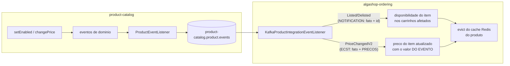

# ECST e validação de eventos: o consumidor reage

> Na [Fase 38](./kafka-na-pratica.md) o evento atravessou a fronteira — e morreu num `log.info`. Esta fase fecha o circuito: o `ordering` **reage** ao que o catálogo publica, e os dois padrões que os [fundamentos de EDA](./fundamentos-eda.md) apresentaram na teoria aparecem lado a lado **no mesmo listener**: notification (Listed/Delisted) e event-carried state transfer (o novo evento de preço, que carrega o estado). Junto vem a terceira peça: Bean Validation nos eventos, dos dois lados do fio — e a descoberta desconfortável do que o Kafka faz, por padrão, com o evento que falha.
> Código real: catálogo — `application/product/event/ProductPriceChangedV2IntegrationEvent.java`, `infrastructure/util/BeanValidationUtil.java`, `infrastructure/kafka/KafkaConfig.java`; ordering — `infrastructure/.../KafkaProductIntegrationEventListener.java`, `infrastructure/config/kafka/KafkaBeanValidationConfigurer.java`, `infrastructure/config/cache/ProductCacheManager.java`, `core/application/shoppingcart/ShoppingCartManagementApplicationService.java`, `core/domain/model/shoppingcart/ShoppingCart.java`.

---

## Notification × ECST — no mesmo listener, lado a lado



Os dois padrões deixaram de ser taxonomia e viraram linhas de código a centímetros uma da outra:

- **Notification** — `ProductListed/DelistedIntegrationEvent` carregam **só o fato e o id**. O consumidor decide o efeito (flipar `available` nos itens de carrinho que contêm o produto) usando apenas o `productId`. Honestidade didática: o notification clássico pressupõe que o consumidor *volte à origem* buscar o estado que precisar — aqui nem isso é necessário, porque o efeito só depende do id. É o notification no seu formato mais magro.
- **ECST** — `ProductPriceChangedV2IntegrationEvent` carrega **o estado**: `oldRegularPrice`, `oldSalePrice`, `newRegularPrice`, `newSalePrice`, `changedAt`. O handler usa `event.getNewSalePrice()` e atualiza os carrinhos **sem nenhuma chamada ao catálogo** — a promessa central do padrão, cumprida. O preço da cópia (a janela de desatualização, a responsabilidade da propagação) o projeto já conhecia da [categoria desnormalizada](../02-persistencia/desnormalizacao-mongo.md); agora ele existe **com canal atravessando a fronteira**.

A escolha de padrão por evento não foi acidente: disponibilidade é um boolean que o próprio fato determina (listou → `true`); preço é um **valor** que alguém precisa transportar — ou o evento o carrega, ou o consumidor faria uma chamada HTTP para cada evento recebido, transformando o broker num gerador de carga síncrona.

## O V2 que nasceu sem V1

O evento de preço chama-se `ProductPriceChangedV2IntegrationEvent` — e **não existe V1 publicada**. O sufixo está no nome de propósito, porque o nome é o contrato: a versão viaja no `__TypeId__` lógico (`ProductCatalog.ProductPriceChangedV2IntegrationEvent`), então uma futura V3 pode conviver com esta **no mesmo tópico** — consumidores antigos seguem lendo V2, e o tipo desconhecido cai no handler default sem quebrar ninguém. É o mecanismo de evolução de contrato que o [`type.mapping` da Fase 38](./kafka-na-pratica.md) comprou, agora usado de propósito: **versionar o contrato antes de precisar é o que torna a evolução possível depois**.

## Validação de eventos — cada lado se protege sozinho

O contrato do V2 é todo `@NotNull`, e a validação roda **duas vezes**, uma em cada serviço:

| Lado | Mecanismo | O que barra |
|---|---|---|
| **Produtor** | `BeanValidationUtil.validate(event)` dentro do publisher (`KafkaConfig`), antes do `send()` | Evento com campo nulo **nem chega ao tópico** — o erro estoura onde há contexto e stack trace |
| **Consumidor** | `KafkaBeanValidationConfigurer` (um `KafkaListenerConfigurer` que faz `registrar.setValidator(...)`) + `@Valid` no `@Payload` | Payload que viole as anotações vira `MethodArgumentNotValidException` **antes** do método do handler rodar |

O detalhe que não é óbvio: **`@Valid` num `@Payload` de Kafka não faz nada sozinho**. Diferente do `@RequestBody` do Spring MVC, o listener não tem validator registrado por padrão — é preciso plugá-lo via `KafkaListenerConfigurer`, e é só isso que a classe nova faz. Sem ela, a anotação fica lá, decorativa, e o `@NotNull` nunca roda — validação que não valida, sem nenhum erro para avisar.

E por que validar dos dois lados, se o produtor já barrou? Porque o consumidor **não confia no produtor** — o contrato é uma cópia manual de POJO casada por forma de JSON; um produtor de outra versão, um replay antigo ou um evento publicado à mão pela UI chegam do mesmo jeito. Defesa em profundidade, agora no fio da mensageria.

## O destino do evento inválido — corrigindo o doc anterior

A [Fase 38](./kafka-na-pratica.md) registrou: "uma exceção num handler vira retentativa infinita do container". **Estava errado — e a verdade é pior.** O `DefaultErrorHandler` padrão do spring-kafka faz `FixedBackOff(0, 9)`: **10 tentativas sem intervalo** e depois **descarta a mensagem, commitando o offset**. Para um erro de validação as 10 tentativas são inúteis (o payload não vai mudar), e o descarte é **perda silenciosa de dados**: um evento de preço malformado some, o carrinho fica com o preço velho para sempre, e o único vestígio é um log de erro que ninguém alertou. Não há DLQ. A pendência de retry/DLQ deixou de ser "evitar loop infinito" e virou "parar de perder eventos em silêncio" — mais urgente, não menos.

## O efeito de negócio: carrinhos e cache

O fluxo no `ordering`, para o evento de preço:

```
@KafkaHandler (@Valid) → ForManagingShoppingCarts.refreshProductPrice(productId, newSalePrice)
    → @Transactional: findAllContainingItem → para cada carrinho:
         ShoppingCart.changeItemPrice → item recalcula o total DELE + carrinho recalcula o DELE
    → ProductCacheManager.evict(productId)   [DEPOIS da atualização]
```

Três decisões com história:

- **A transação única** (`@Transactional` nos dois métodos novos do service): sem ela, cada `add()` abria a própria transação e uma falha no meio deixava metade dos carrinhos atualizada — sem rollback de nada.
- **O evict vem depois da atualização**: invalidar antes abre janela para uma leitura concorrente repovoar o cache com o dado velho enquanto o banco ainda muda.
- **O cache client-side ganhou invalidação por evento.** O [`cache.md`](../01-arquitetura-design/cache.md) tinha cravado: "o dado é de outro serviço e ele não fica sabendo quando muda — sobra o TTL". A Fase 39 revoga a premissa: o serviço agora **fica sabendo**, via Kafka, e o TTL curto virou a segunda linha de defesa (para o evento que se perder — e ele pode, ver acima). Detalhe traiçoeiro: o `ProductCacheManager` usa a API **programática** do cache (`cache.evictIfPresent`), que **não passa** pelo `CacheInterceptor` — logo o `ResilienceCacheErrorHandler` que protege as anotações `@Cacheable` não protege este evict. Redis fora do ar lançaria a exceção direto no handler Kafka; o try/catch no evict cumpre ali o papel que o error handler cumpre nas anotações.

## Armadilhas encontradas (e consertadas)

- **A validação que nunca validava — condição invertida.** O `BeanValidationUtil` saiu com `if (violations.isEmpty()) throw` — o exato oposto: todo evento **válido** explodia e o inválido passava. E como o `validate()` está no publisher genérico, os eventos sem anotação nenhuma (Added/Listed/Delisted, conjunto de violações sempre vazio) lançariam **sempre** — e os seus handlers são síncronos, então o POST/PUT de produto devolveria 500. Compila, os testes não cobrem, e faz o contrário do combinado. Validação é o tipo de código que **só existe se tiver teste do caminho triste**.
- **O total que ninguém recalculava — bug de dinheiro.** `ShoppingCart.changeItemPrice` atualizava o total **do item**, mas não chamava `recalculateTotals()` do **carrinho** — os irmãos `refreshItem` e `changeQuantity` chamam. Resultado: soma dos itens ≠ total do carrinho, persistido assim, visível para o cliente. Junto veio o acesso: `ShoppingCartItem.changeItemPrice` estava `public` (os irmãos são package-private), permitindo furar o agregado por fora e produzir exatamente essa inconsistência.
- **O código pronto que ficou no banco de reservas.** Já existia `ShoppingCartProductAdjustmentService`/`ShoppingCartUpdateProvider`: ajuste de preço em **2 UPDATEs JPQL**, numa transação, **recalculando o total no banco**, com teste de integração. O fluxo novo reimplementou via agregado (carrega → muda → salva), e o caminho bulk virou código morto. A escolha foi **mantida de propósito**: o caminho via agregado exercita as invariantes no domínio — que é o que esta fase estuda — ao custo de N+1 para produto popular. O trade-off agora está escrito no código e aqui; quando o N+1 doer (produto em milhares de carrinhos na thread do consumidor = risco de estourar `max.poll.interval.ms` e provocar rebalance), a troca é a otimização óbvia e já testada.

## O que ainda NÃO existe

- **Idempotência e guarda de ordem.** Nenhuma checagem de `changedAt`/`oldSalePrice` — um replay ou um evento fora de ordem sobrescreve preço mais novo. A matéria-prima **já viaja no evento** e é ignorada: o compare-and-set está a um `if` de distância.
- **Retry com backoff + DLQ** — agora com o diagnóstico certo: o default descarta em silêncio.
- **Outbox no produtor** — seguiu piorando: o handler de preço é `@Async`, então a falha de publicação nem chega ao chamador; o preço muda no banco e o evento não sai, com um log em outra thread como único aviso.
- **Testes** — zero para: validação (o caminho triste teria pego a condição invertida), o handler novo, `findAllContainingItem`, os métodos novos do agregado. O `ShoppingCartUpdateProviderIT` testa um caminho que ninguém mais chama.
- **`production-env` sem type.mapping** — pré-existente, o V2 herda: sem o mapeamento, o `__TypeId__` sairia como FQCN e o consumidor não resolveria.

## Pendências registradas

- [ ] **Idempotência no consumo de preço** — usar `changedAt`/`old*` que já chegam no evento (compare-and-set)
- [ ] **Retry com backoff + DLQ** — `DefaultErrorHandler(DeadLetterPublishingRecoverer, ExponentialBackOff)`; o descarte silencioso de hoje é perda de dados
- [ ] **Outbox no catálogo** — a mais aguda, e o `@Async` no handler de preço a deixou ainda mais silenciosa
- [ ] **Testes**: caminho triste da validação (dois lados), handler → carrinho → total recalculado, e decidir o destino do `ShoppingCartUpdateProviderIT`
- [ ] **Trocar para o caminho bulk quando o N+1 doer** — o código já existe e está testado
- [ ] **Paginar/limitar `findAllContainingItem`** — hoje carrega todos os carrinhos afetados de uma vez

## Checklist de revisão

- [ ] Sei apontar, no mesmo listener, qual handler é notification e qual é ECST — e por que cada evento pediu seu padrão
- [ ] Sei por que o V2 nasceu V2 — e onde a versão do contrato viaja
- [ ] Sei o que o `@Valid` num `@Payload` faz **sem** o `KafkaListenerConfigurer` (nada) — e o que passa a fazer com ele
- [ ] Sei o destino real do evento que falha no consumidor (10 tentativas → descarte com offset commitado) — e por que isso é pior que loop
- [ ] Sei por que o evict vem depois da atualização, e por que a API programática do cache não é protegida pelo `CacheErrorHandler`
- [ ] Consigo defender a escolha agregado × bulk — e dizer quando trocar

## Referências

- [Martin Fowler — What do you mean by "Event-Driven"?](https://martinfowler.com/articles/201701-event-driven.html) (notification × ECST — a taxonomia que esta fase implementa)
- [Spring Kafka — Payload validation](https://docs.spring.io/spring-kafka/reference/kafka/serdes.html) · [DefaultErrorHandler](https://docs.spring.io/spring-kafka/reference/kafka/annotation-error-handling.html) (o `FixedBackOff(0, 9)` e o descarte)
- [Jakarta Bean Validation](https://beanvalidation.org/)
- [Kafka na prática](./kafka-na-pratica.md) · [Fundamentos de EDA](./fundamentos-eda.md) · [Cache](../01-arquitetura-design/cache.md) · [Normalizado × desnormalizado](../02-persistencia/desnormalizacao-mongo.md)
