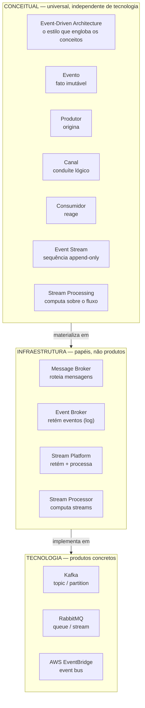

# Arquitetura orientada a eventos: o mapa antes da primeira viagem

> O AlgaShop já é orientado a eventos — **dentro de cada processo**. `OrderPlaced` dispara a fatura, `CategoryUpdated` propaga a categoria desnormalizada, listeners `@Async` pagam consistência eventual há vinte fases. O que não existe ainda é o evento **atravessando a fronteira do serviço**: hoje, quando o processo morre, o evento morre junto. Este documento é o estudo conceitual que abre o módulo de mensageria — os termos, os padrões e as decisões, antes de qualquer broker subir no compose.
> Código real citado (do que já existe): `AbstractAggregateRoot` no ordering e no catálogo · os listeners de [Eventos e listeners](../01-arquitetura-design/eventos-e-listeners.md) · a categoria desnormalizada de [Normalizado × desnormalizado](../02-persistencia/desnormalizacao-mongo.md) · o `SKIP LOCKED` de [Jobs agendados](../04-infraestrutura/scheduled-jobs.md).
> Os eventos in-process em [Eventos e listeners](../01-arquitetura-design/eventos-e-listeners.md) · CQRS em [CQS e CQRS](../01-arquitetura-design/cqrs.md) · quem promete a troca fácil de canal em [Ports & Adapters](../01-arquitetura-design/ports-hexagonal.md).

---

## Os quatro pilares do ciclo de vida de um evento

Todo o vocabulário de EDA se apoia em quatro peças — e numa inversão:

| Pilar | O que é | A regra que o define |
|---|---|---|
| **Evento** | Um **fato imutável**, no passado | `PedidoConfirmado`, nunca `ConfirmarPedido` — evento narra, não ordena |
| **Produtor** | Quem origina o evento | Publica **e esquece**: não conhece, não espera e não depende de quem consome |
| **Canal** | O conduíte lógico entre os dois | Fila, tópico, bus — a escolha do canal é uma decisão de arquitetura (adiante) |
| **Consumidor** | Quem reage ao evento | Decide sozinho o que o fato significa para ele |

A inversão é o coração do estilo: no request-response, **quem chama conhece quem atende** — o `ordering` sabe o endereço do catálogo, espera a resposta, trata a falha. No evento, o produtor anuncia um fato e a dependência aponta para o outro lado: **quem quiser saber, que escute**. O `ordering` não "manda o billing faturar"; ele afirma que um pedido foi confirmado, e o billing é que decidiu se importar.

> **Evento com nome imperativo é comando disfarçado.** Se o produtor só faz sentido quando *aquele* consumidor específico reage, não há desacoplamento — há uma chamada remota vestida de evento. O nome no particípio passado é o teste barato: se não dá para nomear como fato consumado, provavelmente é comando.

---

## Domain event × integration event

O projeto já tem eventos — mas todos de um tipo só, e a distinção é o que muda ao cruzar a fronteira:

**Evento de domínio** fala a língua do agregado e circula **dentro** do bounded context. O `CategoryUpdatedEvent` do catálogo carrega o vocabulário interno do serviço, muda quando o modelo muda, e ninguém de fora o vê. É o que `AbstractAggregateRoot.registerEvent()` produz hoje.

**Evento de integração** é **contrato público** entre serviços: versionado, estável, desenhado para consumidores que o produtor não controla — e que não podem quebrar quando o modelo interno refatorar. O modelo interno **não vaza**: o evento de integração é uma projeção deliberada, como um DTO de saída é para a API REST.

O projeto já viveu essa distinção no mundo síncrono: o [contrato Spring Cloud Contract](../03-testes-integracao/stubs-contract-tests.md) é exatamente isso para HTTP — a promessa pública que sobrevive à refatoração interna. O evento de integração é o contrato da mensageria, e vai precisar do mesmo rigor (versão, compatibilidade, teste).

---

## O que os eventos compram — e o que cobram

**Desacoplamento temporal.** Produtor e consumidor não precisam estar de pé ao mesmo tempo. O billing pode estar reiniciando quando o pedido confirma — o evento espera no canal. Compare com a fase atual: se o listener in-process perder o evento, ele **não volta**.

**Expansão de consumidores.** Um consumidor novo para um evento existente = **zero mudança no produtor**. É o oposto estrutural da chamada HTTP, onde cada integração nova é uma linha nova em quem chama. O dia em que "pedido confirmado" precisar alimentar um serviço de notificações, um de analytics e um antifraude, o `ordering` não fica sabendo.

**Escalabilidade independente.** Consumidores escalam pelo próprio ritmo — e num log particionado, o paralelismo é dado pela partição, não pelo produtor.

**Amortecimento de picos.** A fila absorve a rajada que a chamada síncrona derrubaria — o [teste de carga da Fase 18](../03-testes-integracao/testes-de-carga-k6.md) achou o teto do síncrono; a mensageria é a válvula que o desloca.

E a conta a pagar:

- **Consistência eventual** — o projeto já a paga dentro do processo, e sabe o preço: a janela em que a leitura mente ([Eventos e listeners](../01-arquitetura-design/eventos-e-listeners.md)).
- **Observabilidade** — rastrear um fluxo que atravessa três serviços por eventos exige correlação deliberada; sem ela, cada incidente é arqueologia.
- **A dupla-escrita** — gravar no banco **e** publicar no broker são duas operações; sem um padrão (outbox), uma delas pode acontecer sem a outra, e o evento se perde ou mente. A pendência de outbox que o doc de eventos registra desde a Fase 12 vira obrigação no momento em que o broker existir.

---

## As três camadas: conceito, papel, produto

O mapa que organiza todo o resto — do universal ao concreto:

A tese da separação: **aprenda os papéis, não os produtos.** "Message broker" (roteia e entrega) e "event broker" (retém o log) são papéis — RabbitMQ nasceu no primeiro, Kafka no segundo, e ambos hoje invadem o território do outro. Quem decide arquitetura pelo nome do produto compra o marketing; quem decide pelo papel sabe o que está trocando quando migra.

---

## Os padrões, do mais magro ao mais radical

### Event notification — o evento que só avisa

`{"pedidoId": "42", "evento": "confirmado"}`. Quem precisar de mais, **volta e pergunta** ao produtor via API. Payload mínimo, contrato mínimo — e o custo escondido: o consumidor que volta a perguntar **reintroduz o acoplamento** que o evento prometia remover (o produtor precisa estar de pé, a consulta precisa de resiliência, a carga volta para quem publicou).

### Event-carried state transfer — o evento que carrega o estado

O evento leva os dados que o consumidor precisa; ninguém volta para perguntar. O consumidor mantém a **própria cópia** e vive dela.

> O projeto **já pratica ECST** — sem broker. A categoria desnormalizada dentro do produto ([Normalizado × desnormalizado](../02-persistencia/desnormalizacao-mongo.md)) é exatamente isso: o evento `CategoryUpdated` carrega o estado novo, o listener atualiza a cópia embutida, e as leituras nunca voltam à origem. Todo o aprendizado daquele doc — a cópia que cobra, a janela de desatualização, a propagação como responsabilidade — é o aprendizado de ECST. Só falta o canal atravessar a fronteira.
>
> 🔄 **Retrofit (Fase 39):** o canal atravessou. `ProductPriceChangedV2IntegrationEvent` carrega os preços pelo Kafka e o `ordering` atualiza os carrinhos **sem consultar o catálogo** — ECST de verdade, entre serviços. E no mesmo listener, Listed/Delisted fazem notification: os dois padrões desta seção, lado a lado em código, em [ECST e validação de eventos](./ecst-e-validacao-de-eventos.md).

### Event sourcing — os eventos são a verdade

Aqui o salto é qualitativo: o estado atual **não é armazenado** — é *projetado* a partir do log de eventos, que passa a ser a fonte de verdade. Auditoria perfeita, viagem no tempo, reprocessamento — e complexidade em tudo: versionamento de eventos antigos, snapshots, projeções.

> **"Usar eventos" não é event sourcing.** Quase todo sistema publica eventos; pouquíssimos precisam que os eventos SEJAM o banco. Confundir os dois é a forma mais cara de adotar EDA.

### CQRS — quando os eventos sincronizam os dois lados

O projeto já separa comando de consulta ([CQS e CQRS](../01-arquitetura-design/cqrs.md)) dentro do mesmo banco. A forma plena — modelo de escrita e modelo de leitura em **bancos separados** — precisa de algo que os sincronize, e esse algo é o evento: cada escrita publica, a projeção de leitura consome e se atualiza. EDA é o que transforma o CQRS "de pacote" no CQRS de dois bancos.

### Publish-subscribe — um fato, N reações

O padrão que materializa a expansão de consumidores: cada assinante recebe a **própria cópia** do evento e reage independente. É o modo natural de evento de integração — e o assunto da próxima seção, porque nem todo canal o oferece do mesmo jeito.

---

## Ponta-a-ponta × publish-subscribe: os dois padrões de canal

| | Ponta-a-ponta (fila) | Publish-subscribe (tópico) |
|---|---|---|
| Entregas por mensagem | **Uma** — consumidores competem | **Uma por assinante** — cada um tem a sua cópia |
| Uso natural | distribuir **trabalho** ("alguém processe isto") | anunciar **fato** ("aconteceu isto") |
| Consumidor novo | divide a carga dos existentes | ganha o próprio fluxo, sem afetar ninguém |

O projeto já tem uma fila ponta-a-ponta — em Postgres: o `SKIP LOCKED` do [billing-scheduler](../04-infraestrutura/scheduled-jobs.md) faz instâncias **competirem** por linhas, cada fatura processada por exatamente uma. É o modelo mental de *work queue* completo, sem broker. O que a mensageria acrescenta é o segundo padrão: o fato anunciado que N interessados consomem sem competir.

---

## Fila × log: a diferença que separa RabbitMQ de Kafka

A distinção mais importante do módulo — e a mais mal explicada por aí:

| | RabbitMQ (queue) | Kafka (topic) |
|---|---|---|
| A mensagem consumida | é **removida** (ack → some da fila) | **permanece** — o tópico é um log append-only |
| Quem sabe o que foi lido | o **broker** controla a entrega | o **consumidor** carrega o próprio *offset* |
| Consumidor novo | vê só o que chegar **daqui em diante** | pode **reler a história inteira** desde o offset zero |
| Retenção | até o consumo (transiente) | por política de tempo/tamanho — dias, meses, para sempre |
| Modelo mental | correio: entregou, acabou | fita de vídeo: cada um assiste do ponto em que está |
| Paralelismo | consumidores competindo na fila | partições — a ordem é garantida **por partição**, não por tópico |

A consequência que muda arquitetura: no log, a **expansão de consumidores é retroativa**. O serviço de analytics que nascer daqui a um ano pode consumir todos os pedidos confirmados desde sempre — no modelo de fila, o passado não existe mais para ele. É por isso que o diagrama chama o Kafka de *event broker/stream platform* e o RabbitMQ de *message broker*: reter é o que separa os papéis.

E a fronteira borrou de propósito: **RabbitMQ Streams** (daí o "queue / stream" do diagrama) acrescenta um log retido ao broker de filas — mais um motivo para decidir pelo papel, não pelo logotipo.

> 🔄 O mecanismo por trás da coluna Kafka — partições, offsets, consumer groups, o cluster e o KRaft — está destrinchado em [Kafka a fundo](./kafka-fundamentos.md).

---

## Coreografia × orquestração: quem rege o fluxo

Um fluxo de negócio que atravessa serviços — pedido → fatura → cobrança → confirmação — pode ser desenhado de dois jeitos:

**Coreografia**: não há maestro. Cada serviço reage ao evento anterior e emite o seu: o `ordering` publica `PedidoConfirmado`; o `billing` escuta, fatura, publica `FaturaEmitida`; o `ordering` escuta e marca pago. O fluxo **emerge** das assinaturas.
— Barato para evoluir (passo novo = assinante novo, ninguém muda), sem ponto central de falha. Caro para **entender**: o fluxo inteiro não está escrito em lugar nenhum, e responder "onde parou o pedido 42?" exige correlacionar eventos de N serviços.

**Orquestração**: um coordenador conhece o fluxo e **comanda** cada passo, tratando respostas e falhas. O processo inteiro é legível num único lugar.
— Barato para entender e para compensar (o orquestrador sabe o que desfazer quando o passo 3 falha). Caro em acoplamento: o coordenador conhece todos, e vira o gargalo de evolução — todo fluxo novo passa por ele.

A regra prática que este módulo vai testar: **fluxo curto, linear e estável → coreografia; fluxo longo, com ramificações e compensações → orquestração.** O fluxo pedido→fatura do AlgaShop, hoje, é curto — candidato natural a nascer coreografado. Quando existir "cancelar pedido já faturado com estorno no gateway", a conversa sobre orquestração (e sobre **sagas**, o padrão que formaliza compensação distribuída) volta com material concreto.

---

## Armadilhas

- **Comando fantasiado de evento** — nome imperativo, produtor que depende da reação de um consumidor específico. O desacoplamento é o teste, não a tecnologia.
- **ECST desatualizado é o preço da cópia** — o projeto já conhece pela categoria desnormalizada: quem carrega estado nos eventos assume a janela de inconsistência e a responsabilidade da propagação.
- **Dupla-escrita sem outbox perde evento** — commit no banco e publish no broker não são atômicos; a falha entre os dois cria o pedido sem evento (ou o evento sem pedido). Não existe mensageria séria sem resposta para isso.
- **"Adotamos Kafka" não é "fizemos event sourcing"** — usar um log retido como canal continua sendo estado-no-banco + eventos-como-integração. Sourcing é outra decisão, muito mais cara.
- **Coreografia sem observabilidade** é um fluxo que ninguém consegue explicar em produção — correlação (um id que atravessa os eventos) entra junto com o primeiro evento, não depois do primeiro incidente.
- **Notificação magra que todo mundo enriquece com GET** devolve, por baixo, o acoplamento síncrono que o evento prometia tirar — medir quantos consumidores "voltam para perguntar" é medir quanto do desacoplamento é real.

## Pendências registradas

O mapa do módulo que este documento abre:

- [x] ~~**Escolher o broker** — pelo papel: o fluxo pedido→fatura precisa de fila ou de log? Consumidores futuros precisarão do passado?~~ — 🔄 Kafka (Fase 38): consumidores futuros dos eventos de catálogo precisam do passado, e a expansão retroativa só o log dá. Ver [Kafka na prática](./kafka-na-pratica.md).
- [x] ~~**O primeiro evento a atravessar a fronteira**: `pedido confirmado` (ordering → billing), hoje interno ao processo.~~ — 🔄 atravessou na Fase 38, mas por outro par: produto listado/deslistado (**catálogo → ordering**), key = id do produto. O `pedido confirmado` continua no mapa.
- [ ] **Outbox no produtor** — a pendência da Fase 12 vence quando o broker chegar.
- [ ] **Contrato de evento versionado** — o equivalente de mensageria do Spring Cloud Contract, com teste que o trave.
- [ ] **DLQ, retentativa e reconciliação** — já listadas na linha do tempo; ganham dono quando houver canal.
- [ ] **Correlação ponta a ponta** — o id que conta a história de um pedido através dos serviços.

## Checklist de revisão

- [ ] O nome do evento é um fato no passado — ou um comando disfarçado?
- [ ] Este evento é de domínio (interno) ou de integração (contrato público)? Quem pode quebrar se ele mudar?
- [ ] Notificação magra ou estado carregado — e quantos consumidores vão "voltar para perguntar"?
- [ ] O canal precisa de entrega única (trabalho) ou de cópia por assinante (fato)?
- [ ] Um consumidor futuro precisará do **passado**? Então é log, não fila.
- [ ] O fluxo tem compensação? Então a conversa é orquestração/saga, não só eventos soltos.
- [ ] Como o evento sobrevive ao crash entre o commit e o publish?

## Referências

- [Martin Fowler — What do you mean by "Event-Driven"?](https://martinfowler.com/articles/201701-event-driven.html) (notification, ECST, sourcing, CQRS — a taxonomia deste doc)
- [Martin Fowler — Event Sourcing](https://martinfowler.com/eaaDev/EventSourcing.html)
- [Enterprise Integration Patterns — Hohpe & Woolf](https://www.enterpriseintegrationpatterns.com/) (ponta-a-ponta, pub-sub, canais)
- [Kafka — Introduction](https://kafka.apache.org/documentation/#gettingStarted) · [RabbitMQ — Concepts](https://www.rabbitmq.com/tutorials/amqp-concepts)
- [Microservices.io — Saga](https://microservices.io/patterns/data/saga.html) · [Transactional Outbox](https://microservices.io/patterns/data/transactional-outbox.html)
- [Kafka a fundo](./kafka-fundamentos.md) · [Eventos e listeners](../01-arquitetura-design/eventos-e-listeners.md) · [CQS e CQRS](../01-arquitetura-design/cqrs.md) · [Normalizado × desnormalizado](../02-persistencia/desnormalizacao-mongo.md) · [Jobs agendados](../04-infraestrutura/scheduled-jobs.md)
