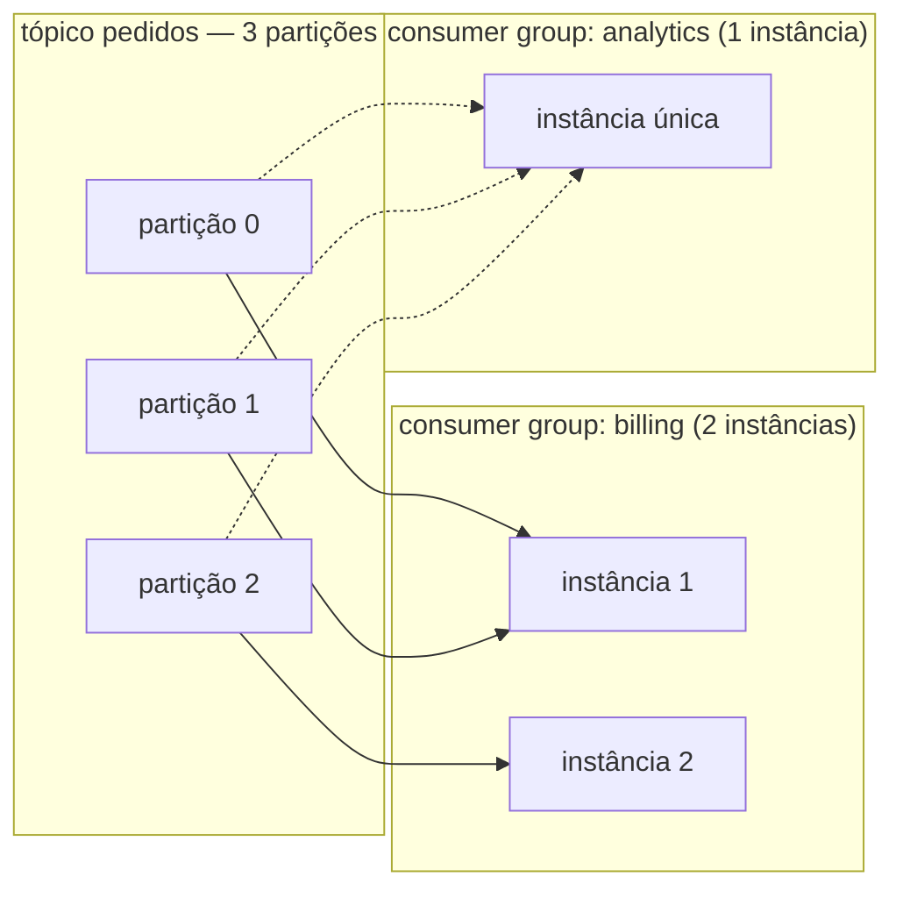
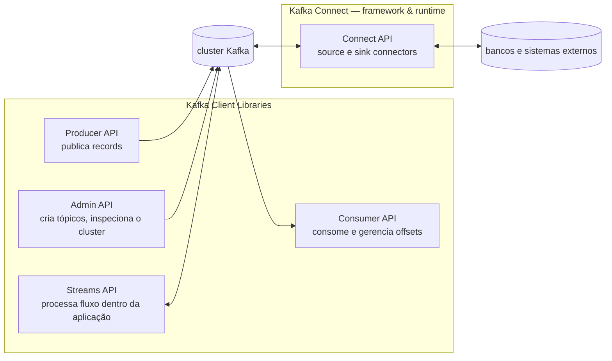

# Kafka a fundo: o log que virou plataforma

> Os [fundamentos de EDA](./fundamentos-eda.md) estabeleceram a distinção que separa mundos — fila que remove × log que retém — e avisaram: aprenda os papéis, não os produtos. Este doc abre a caixa do produto que ocupa **dois papéis de uma vez** no diagrama das três camadas: event broker (retém o log) e stream platform (processa sobre ele). Nada aqui é implementação ainda — é o funcionamento interno que as decisões do módulo vão exigir: o que é um record, onde a ordem mora, como consumidores se dividem e como o cluster sobrevive à queda de um broker.
> Documento conceitual — o Kafka ainda não existe no projeto. As pendências do fim são o mapa da sua chegada.
> O mapa conceitual em [Fundamentos de EDA](./fundamentos-eda.md) · os eventos que vão atravessar em [Eventos e listeners](../01-arquitetura-design/eventos-e-listeners.md) · a fila em Postgres que já existe em [Jobs agendados](../04-infraestrutura/scheduled-jobs.md).

---

## Record ≠ message: a mudança de substantivo é a mudança de modelo

O vocabulário do Kafka troca *message* por **record**, e a troca carrega a arquitetura inteira:

- **Message** é volátil e passageira — nasce para ser **entregue**: o broker a carrega até o consumidor, recebe o ack e a descarta. O modelo do correio: entregou, acabou.
- **Record** é durável e **registrado** — nasce para ser **gravado**: entra por *append* no fim do log, imutável, ordenado, e ganha uma identidade (o offset). Consumir não o afeta em nada. O modelo do livro-razão: a leitura não apaga a linha.

A consequência prática já apareceu no doc anterior (consumidor novo pode reler a história); aqui entra o mecanismo. E a anatomia do record é onde as decisões de design moram:

| Campo | O que é | A decisão que carrega |
|---|---|---|
| **key** | bytes opcionais que identificam a **entidade** do fato | Define **para qual partição** o record vai — e portanto **de quê a cronologia é garantida**. É a decisão mais importante do tópico |
| **value** | o fato em si (o payload) | O contrato de integração — serialização e versão são decisões deste campo |
| **timestamp** | quando aconteceu | Dois modos: *event-time* (o produtor diz) × *log-append-time* (o broker carimba) — divergem sob atraso, e analytics sente a diferença |
| **headers** | metadados chave-valor | Onde vive o que não é fato: **correlation id**, versão do schema, origem — a correlação ponta-a-ponta do doc anterior mora aqui |

> **Nota de vocabulário:** "routing key" é termo do **RabbitMQ** (a chave que o exchange usa para rotear a mensagem a filas). No Kafka o conceito análogo é a **key do record** — e a semântica é outra: ela não escolhe destino entre filas; escolhe a **partição** dentro do tópico, e com isso define a ordem. Usar o termo do Rabbit no mundo Kafka confunde exatamente a parte que mais importa.

---

## O tópico por dentro: o nome é lógico, a partição é o arquivo

**Tópico** é o nome que produtores e consumidores conhecem. Fisicamente, ele não existe — o que existe são as suas **partições**, e cada partição é um **log em disco** (uma sequência de arquivos de segmento) com quatro propriedades:

- **Append-only** — todo record entra no fim; não há inserção no meio.
- **Imutável** — gravou, não muda; correção é um record novo.
- **Ordenado** — a posição no log é o **offset**, monotônico por partição.
- **Processável** — por ser um log ordenado e retido, dá para computar sobre ele (a porta do stream processing).

O **offset não é "lido/não-lido"** — é só uma posição. Quem transforma posição em progresso é o consumidor, guardando "parei no offset N". O broker não marca nada: dez grupos podem estar em dez pontos diferentes do mesmo log.

### A ordem mora na partição — e a key decide quem mora onde

A garantia de ordem do Kafka é precisa e limitada: **records na mesma partição são lidos na ordem em que entraram. Entre partições, não há ordem nenhuma.**

É aqui que a key fecha o desenho: `hash(key) % partições` → todos os records com a mesma key caem **na mesma partição** → a cronologia da entidade está garantida. Todos os eventos do pedido 42, na ordem, sempre — mas nada se promete sobre a intercalação entre o pedido 42 e o pedido 43.

> **Ordem global não existe — e prometê-la é o erro clássico.** O desenho certo pergunta: *de quê* eu preciso de cronologia? A resposta vira a key. Sem key, o produtor distribui round-robin — throughput ótimo, cronologia por entidade **perdida**.

### Ler não apaga — quem apaga é a retention

Consumir um record não o remove (a "leitura sem exclusão" que define o log). Quem remove é a **política de retenção** — por tempo ou por tamanho, por tópico. E o default surpreende: **7 dias**, não "para sempre". O log retém a história *que a retention cobrir* — o consumidor novo que "pode reler tudo" pode reler até onde a política deixou. Retenção infinita existe (e compactação por key também), mas é decisão declarada, não comportamento natural.

---

## Consumer groups: dois padrões de canal no mesmo tópico

O doc anterior separou ponta-a-ponta de pub-sub. O Kafka entrega **os dois ao mesmo tempo**, e o consumer group é a dobradiça:

**Entre grupos: pub-sub.** Cada grupo carrega o próprio conjunto de offsets — o grupo do billing e o grupo do analytics leem o mesmo tópico (e as **mesmas partições**) sem se enxergarem, cada um no seu ponto da história.

**Dentro do grupo: ponta-a-ponta.** As partições do tópico são **distribuídas entre as instâncias** do grupo — cada record é processado por exatamente uma instância do grupo, como numa work queue.

As regras da distribuição, que valem decorar porque explicam todo comportamento estranho de consumo:

1. **Um consumer pode ler várias partições** (3 partições, 1 instância → ela lê as 3).
2. **Uma partição nunca é lida por duas instâncias do mesmo grupo** — a exclusividade é o que preserva a ordem da partição no processamento.
3. Consequência direta: **instâncias além do número de partições ficam ociosas**. 3 partições, 5 instâncias → 2 paradas. *O número de partições é o teto do paralelismo do grupo* — e por isso é uma decisão de capacidade, não um detalhe.
4. Instância entra ou sai → **rebalance**: o grupo redistribui as partições. Necessário e custoso — durante o rebalance, o consumo pausa.

O mesmo tópico, os dois padrões: dentro do billing, trabalho dividido; entre billing e analytics, cópias independentes do fluxo inteiro.

---

## Push × pull: quem dita o ritmo

Um broker pode **empurrar** mensagens ao consumidor (push — o modelo do RabbitMQ, regulado por prefetch) ou o consumidor pode **buscá-las** (pull). O Kafka é **pull por padrão**, e a escolha é coerente com o log:

- **Backpressure natural**: o consumidor lento simplesmente busca menos — ninguém precisa detectar sobrecarga do outro lado, e o broker nunca afoga ninguém.
- **Batch de graça**: quem busca decide quanto busca — consumidores atrasados leem em lotes grandes e recuperam terreno.
- O risco do pull — busy-wait quando não há nada — é resolvido com **long polling**: o fetch espera no broker até haver dados (ou estourar o tempo).

O push otimiza latência de entrega individual; o pull otimiza throughput e autonomia do consumidor. Para um log que retém, o pull é a escolha natural: o dado não tem pressa — ele não vai a lugar nenhum.

---

## O cluster: dividir o trabalho, sobreviver à queda

Um **broker** é um servidor Kafka; um **cluster** é o conjunto. A escala horizontal vem da distribuição: as partições de cada tópico se espalham pelos brokers — mais brokers, mais partições servidas em paralelo, mais throughput agregado.

A durabilidade vem da **replicação**: cada partição tem um *replication factor* (3 é o clássico) — uma réplica **leader** e as demais **followers**:

- O **leader recebe as escritas** (e, por padrão, serve as leituras) da sua partição.
- Os **followers replicam** o log do leader — os que estão em dia formam o ISR (*in-sync replicas*).
- **Leader caiu → elege-se um novo leader entre os followers em sincronia.** A partição continua a mesma, o log continua o mesmo — só a liderança muda de broker. O cluster se cura sem perder dados (desde que a escrita tenha esperado o ISR — o `acks`, que fica para o doc prático).

Repare no plural das lideranças: cada **partição** tem seu leader, e eles se espalham pelo cluster — todo broker é leader de algumas partições e follower de outras. Não há "o servidor principal"; há centenas de pequenas lideranças distribuídas.

### KRaft: o cluster que se coordena sozinho

Alguém precisa saber quem é leader de quê, quais brokers vivem, onde cada partição mora — os **metadados** do cluster. Por anos esse papel foi do ZooKeeper (um segundo sistema para operar, com seu próprio quorum). O **KRaft** internalizou o papel: os metadados viraram, apropriadamente, **um log Kafka**, replicado entre **controllers** que formam um quorum Raft — um deles ativo, os demais prontos para assumir.

Dois modos de rodar:

| | Modo dedicado | Modo combinado |
|---|---|---|
| Processos | controllers separados dos brokers | broker **e** controller no mesmo processo |
| Para quê | produção — isola a coordenação da carga de dados | desenvolvimento e clusters pequenos |
| No projeto | um dia | **é o que o compose vai usar** — um processo, os dois papéis |

---

## O ecossistema: quatro APIs e um framework

O produto "Kafka" é maior que o broker — o desenho clássico do ecossistema:

- **Producer/Consumer API** — o feijão com arroz: publicar e consumir (é por onde o Spring entra, via `spring-kafka`).
- **Admin API** — tópicos, partições, configs, por código.
- **Streams API** — processamento **dentro da aplicação**: agregações, joins e janelas sobre o fluxo, lendo de tópicos e escrevendo em tópicos. É o "stream processing" do diagrama de camadas virando biblioteca.
- **Kafka Connect** — integração de dados **por configuração, não por código**: *source connectors* trazem dados de fora para tópicos (a porta de entrada do CDC — capturar o que muda num banco e publicar como eventos), *sink connectors* despejam tópicos em bancos, índices, data lakes. Um runtime próprio executa os connectors — a aplicação nem participa.

---

## Casos de uso — e por que o log aguenta grandes volumes

Os quatro territórios onde o Kafka é a resposta idiomática:

1. **Mensageria / EDA entre serviços** — o caso do projeto: eventos de integração atravessando fronteiras, com a expansão retroativa de consumidores que o log permite.
2. **Streaming e processamento em tempo real** — métricas, detecção de fraude, agregações contínuas: a Streams API computando sobre o fluxo enquanto ele acontece.
3. **Integração de dados** — Connect/CDC sincronizando sistemas que nunca se conheceram, com o tópico como ponto de encontro.
4. **Pipelines de grande volume** — logs, telemetria, clickstream: milhões de records por segundo.

O quarto caso parece bravata até olhar o design. O log é rápido **porque** é burro: escrita **sequencial** em disco (a operação que HDs e SSDs mais amam), leitura sequencial servida do page cache do SO, **batches** em toda fronteira (produtor agrupa, broker grava em lote, consumidor busca em lote) e **zero-copy** do arquivo para a rede — o broker mal toca nos bytes que serve. Reter tudo é barato precisamente porque o broker não faz quase nada com cada record além de anexá-lo e entregá-lo.

> **A genialidade do Kafka é a ausência**: sem roteamento por mensagem, sem estado de entrega por consumidor, sem remoção por ack. Cada coisa que o broker *não* faz é throughput que sobra.

---

## Armadilhas

- **Prometer ordem global.** Ela não existe — a ordem é por partição. Todo desenho começa por "cronologia de quê?" e a resposta vira a key.
- **Key como detalhe opcional.** Sem key = round-robin = eventos da mesma entidade espalhados entre partições = cronologia perdida — e o bug só aparece sob concorrência.
- **Aumentar partições depois muda o mapa.** `hash(key) % N` com N novo manda as MESMAS keys para partições diferentes dali em diante — a cronologia por entidade quebra na fronteira da mudança. Dimensione partições olhando o paralelismo futuro, não o atual.
- **Retention default não é "para sempre".** 7 dias. O consumidor que "vai reler a história" relê a história que sobrou.
- **Mais instâncias que partições** = instâncias pagas para não fazer nada. O teto do paralelismo se decide na criação do tópico.
- **Consumer lag é a métrica de saúde** — a distância entre o fim do log e o offset do grupo. Um grupo com lag crescente está afundando em silêncio; ninguém percebe sem monitorar.
- **Rebalance tempestuoso**: consumidor instável (crash em loop, timeouts) faz o grupo redistribuir partições sem parar — e o consumo para a cada dança.

## Pendências registradas

Continuação do mapa do módulo, agora com forma concreta:

- [ ] **Subir o Kafka no compose** — KRaft em **modo combinado** (um processo, broker + controller), o formato certo para dev.
- [ ] **O primeiro tópico**: `pedido confirmado` com **key = id do pedido** — a cronologia que o billing precisa é por pedido.
- [ ] **Serialização e contrato do record** — JSON? Avro? O `value` é contrato público; a decisão pede o rigor do Spring Cloud Contract.
- [ ] **Partições do primeiro tópico** — decidir olhando o paralelismo que o billing pode querer, não o que precisa hoje.
- [ ] **Monitorar consumer lag desde o primeiro consumidor** — a métrica entra junto com o grupo, não depois do primeiro incidente.

## Checklist de revisão

- [ ] A key escolhida dá a cronologia **de quê**? É a entidade certa?
- [ ] Quantas partições = quanto paralelismo futuro? O grupo vai crescer até onde?
- [ ] O consumidor novo precisa do passado? A retention configurada cobre esse passado?
- [ ] O grupo é de trabalho (dividir) ou de assinatura (copiar)? São grupos distintos?
- [ ] O que acontece com o processamento durante um rebalance — e com que frequência ele ocorre?
- [ ] Quem olha o consumer lag — e a partir de que valor ele acorda alguém?

## Referências

- [Kafka — Design](https://kafka.apache.org/documentation/#design) (log, replicação, pull, zero-copy — o porquê de cada escolha, pela fonte)
- [Kafka — KRaft](https://kafka.apache.org/documentation/#kraft)
- [Confluent — Consumer Groups](https://developer.confluent.io/courses/architecture/consumer-group-protocol/)
- [Jay Kreps — The Log: What every software engineer should know](https://engineering.linkedin.com/distributed-systems/log-what-every-software-engineer-should-know-about-real-time-datas-unifying) (o ensaio que explica por que o log é a abstração)
- [Fundamentos de EDA](./fundamentos-eda.md) · [Eventos e listeners](../01-arquitetura-design/eventos-e-listeners.md) · [Jobs agendados](../04-infraestrutura/scheduled-jobs.md)
