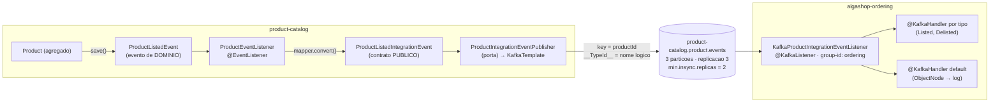

# Kafka na prática: o primeiro evento de integração ponta a ponta

> Dois documentos prepararam este momento: os [fundamentos de EDA](./fundamentos-eda.md) deram o mapa (notification × ECST, fila × log) e o [Kafka a fundo](./kafka-fundamentos.md) abriu o produto (record, partição, consumer group, KRaft). Agora o broker **existe**: um cluster de 3 nós no compose, um tópico replicado, e o primeiro evento que atravessa a fronteira entre serviços — `product-catalog` publica, `ordering` consome. O rumo previsto era `pedido confirmado` (ordering → billing); o curso escolheu começar pelo par catálogo → ordering, e a mudança é registrada nas pendências dos docs anteriores.
> Código real: catálogo — `infrastructure/kafka/KafkaConfig.java`, `application/product/event/` (os 3 eventos + a porta), `infrastructure/listener/product/ProductEventListener.java`; ordering — `infrastructure/adapters/in/messaging/kafka/product/KafkaProductIntegrationEventListener.java`, `infrastructure/config/kafka/KafkaConsumerTypeIdIdentifier.java`; infra — `docker-compose.tools.yml` (3 brokers + UI).

---

## O fluxo ponta a ponta



O evento nasce **duas vezes**, e isso é decisão, não redundância:

1. **Evento de domínio** (`ProductListedEvent`) — a língua interna do agregado, publicado pela `LocalEventPublisher` dentro do processo, como desde a Fase 8.
2. **Evento de integração** (`ProductListedIntegrationEvent`) — o contrato público, uma **projeção deliberada** (id + instante) que pode versionar independente do modelo interno. O `ProductEventListener` faz a promoção: recebe o de domínio, converte com o mapper, entrega à segunda porta.

É a distinção domain × integration event dos [fundamentos](./fundamentos-eda.md#domain-event--integration-event) saindo do papel — e com ela a **segunda porta**. A [`LocalEventPublisher`](../01-arquitetura-design/eventos-e-listeners.md) continua entregando eventos de domínio in-process; a `ProductIntegrationEventPublisher` entrega eventos de integração ao broker. O dia em que "isso viraria Kafka" chegou, e a resposta **não foi trocar o bean da porta antiga** — foi criar uma porta nova, porque nem todo evento de domínio merece atravessar a fronteira do serviço (dos 7 eventos do `Product`, só 3 saem; os outros 4 têm o `send` comentado à espera de um consumidor que os justifique).

## A key é a decisão mais importante — e ela mora no evento

Todo evento de integração implementa uma interface de um método:

```java
// application/IntegrationEvent.java
public interface IntegrationEvent {
    String getAggregateId();
}
```

O publisher usa esse valor como **key do record**: `kafkaTemplate.send(topico, event.getAggregateId(), event)`. A key decide a partição, a partição decide a ordem — logo **todos os eventos do mesmo produto chegam em ordem ao consumidor**, e produtos diferentes se intercalam livremente. É a cronologia por agregado que o [doc de fundamentos](./kafka-fundamentos.md) prometeu, agora com dono: quem sabe qual agregado originou o fato é o próprio evento, então a key nasce nele — o publisher só transporta, sem receber `destination` nem `key` na assinatura.

O tópico tem **3 partições, replicação 3 e `min.insync.replicas=2`**, declarado por `NewTopic` no `KafkaConfig` com o nome vindo das properties (`@NotBlank` — sem nome de tópico, o boot cai na hora). Com `admin.fail-fast: true`, o catálogo nem sobe sem broker: melhor um container que morre gritando do que um serviço no ar publicando no vazio.

## `__TypeId__` lógico: o contrato é um NOME, não uma classe

O `JacksonJsonSerializer` grava em cada record um header `__TypeId__` dizendo que tipo é o payload. Por padrão ele grava o **nome da classe Java do produtor** — e aí o consumidor precisaria ter a mesma classe no mesmo pacote, acoplando os dois serviços pelo pior fio possível. O projeto corta esse fio com `spring.json.type.mapping` **dos dois lados**:

```
produtor  → ProductCatalog.ProductListedIntegrationEvent : com.algaworks...ProductListedIntegrationEvent
consumidor → ProductCatalog.ProductListedIntegrationEvent : com.gtech...ProductListedIntegrationEvent
```

O que viaja no header é o **nome lógico** (`ProductCatalog.ProductListedIntegrationEvent`); cada lado o mapeia para a **sua** classe local. O contrato entre os serviços passa a ser nome lógico + forma do JSON — o consumidor mantém uma **cópia manual** do POJO (sem jar compartilhado, decisão antiga do projeto), e nenhum dos dois conhece os pacotes do outro.

No ordering, quem resolve o nome é o `KafkaConsumerTypeIdIdentifier` — um método estático referenciado por `spring.json.value.type.method` que lê o header, consulta o mapeamento e devolve o `JavaType`. E o seu **fallback** é metade do design: mensagem sem header, ou com nome não mapeado, vira `ObjectNode` genérico em vez de exceção.

## O consumidor: dispatch por tipo e a rede de segurança

```java
@Component
@KafkaListener(topics = "${algashop.messaging.kafka.product-event-topic-name}")
public class KafkaProductIntegrationEventListener {

    @KafkaHandler
    public void handle(@Payload ProductListedIntegrationEvent event, ...) { ... }

    @KafkaHandler
    public void handle(@Payload ProductDelistedIntegrationEvent event, ...) { ... }

    @KafkaHandler(isDefault = true)
    public void handle(@Payload Object object, ...) {
        log.info("Event ignored: key = {}, offset = {}", messageKey, messageOffset);
    }
}
```

`@KafkaListener` na classe + `@KafkaHandler` por método: o Spring despacha pelo **tipo já desserializado**. E o `isDefault = true` fecha o circuito aberto pelo fallback do identifier: evento desconhecido → `ObjectNode` → handler default → log e segue. **`ProductAddedIntegrationEvent` está fora do `type.mapping` do consumidor de propósito** — é o exemplo vivo, rodando em dev, de que o produtor pode publicar um evento novo sem quebrar o consumidor antigo. Ignorar em silêncio (com log) é decisão de compatibilidade, não preguiça.

O `group-id: ordering` faz todas as instâncias do serviço agirem como **um grupo**: as 3 partições se dividem entre elas (no máximo um consumidor do grupo por partição), e o offset commitado pertence ao grupo. Escalar o ordering divide trabalho; um serviço **novo** interessado nos mesmos eventos entraria com **outro** group-id e leria tudo de novo — a expansão retroativa que só o log permite.

Na cadeia de desserialização, o `ErrorHandlingDeserializer` embrulha o `JacksonJsonDeserializer`: JSON malformado vira erro tratável em vez de **poison pill** — sem ele, a mensagem podre derruba o consumidor, o container reinicia, relê o mesmo offset e morre de novo, para sempre.

## O cluster: 3 nós KRaft e a pegadinha dos dois endereços

O [doc anterior](./kafka-fundamentos.md) previu "KRaft modo combinado, um processo". O compose subiu o modo combinado, mas com **3 nós** (`apache/kafka:4.3.1`, cada um `controller,broker`): mais pesado para dev, porém é o que permite replicação 3 e `min.insync.replicas=2` de verdade — dá para derrubar um broker e ver o failover acontecer, o que "um processo" jamais ensinaria.

Cada broker anuncia **dois listeners**, e essa é a parte que mais quebra ambiente local:

| Listener | Endereço anunciado | Quem usa |
|---|---|---|
| `PLAINTEXT` (interno) | `algashop-kafka-N:9090` | brokers entre si, serviços no compose, Kafka UI |
| `EXTERNAL` | `localhost:9092/9093/9094` | aplicações rodando no host (bootRun, IDE) |

O bootstrap é só o primeiro passo: o cliente conecta, recebe o **endereço anunciado** do líder de cada partição e passa a usar **esse** endereço. Por isso o perfil `docker` dos dois serviços **sobrescreve** o bootstrap para `algashop-kafka-N:9090` — herdando o do `development-env` (portas EXTERNAL), o container receberia `localhost:9092` do broker e tentaria conectar em si mesmo. Os hostnames `algashop-kafka-N` entraram no `etc/hostnames/hostnames` para o cenário host, e os brokers ganharam healthcheck (socket TCP no 9090 via `/dev/tcp` — a imagem não tem `curl` nem `nc`) para o `depends_on` do catálogo (fail-fast) e do ordering esperarem o quorum eleger-se. A **Kafka UI** (porta 9084) olha o cluster por dentro: tópicos, partições, offsets — e o consumer lag, que ainda não tem métrica.

## Armadilhas encontradas

- **Nome de bean dentro de SpEL é contrato implícito** — terceira aparição da lição (o `@securityChecks` do billing pagou primeiro). O tópico do `@KafkaListener` começou como `#{algaShopMessagingKafkaProperties.productEventTopicName}`: funciona, mas um rename da classe muda o nome do bean e quebra em runtime sem nenhum aviso do compilador. Virou placeholder de propriedade (`${algashop.messaging.kafka.product-event-topic-name}`) — mesma fonte, zero acoplamento a nome de bean.
- **Typo quase virou contrato.** O campo saiu como `deslistedAt` no evento de integração dos dois lados. Consertar **antes** do primeiro deploy custou um rename; depois que o JSON circula, renomear campo é quebra de contrato com todos os consumidores. O typo continua no evento de **domínio** (interno, barato de conviver) — e como o `ModelMapper` do catálogo é `STRICT`, o de-para `deslistedAt → delistedAt` precisou ser **explícito** no `ModelMapperConfig`, senão o campo iria **nulo no JSON, sem erro nenhum** (a mesma lição silenciosa do `paymentMethod` no billing).
- **A cópia manual do POJO não tem rede.** O contrato REST tem Spring Cloud Contract; o contrato de mensageria é uma cópia à mão, casada só pela forma do JSON. Um campo renomeado no produtor vira `null` no consumidor sem nenhum teste falhar.

## O que ainda NÃO existe — dito com todas as letras

- **Outbox.** O `ProductEventListener` roda síncrono após o `save()`: o Mongo commitou e o `send()` ao Kafka pode falhar — o **dual-write** está exposto no caminho mais importante do módulo. A pendência da Fase 12 deixou de ser teórica: agora há um evento real saindo sem ela.
- **Retry/DLQ no consumidor.** Uma exceção num `@KafkaHandler` hoje vira retentativa infinita do container na mesma mensagem.
- **Efeito de negócio.** Os handlers do ordering só logam — o evento chega e nada muda no domínio. A reação (e a idempotência que ela exigirá) é a próxima fase.
- **Testes.** Zero. O `spring-boot-starter-kafka-test` está no `build.gradle` do catálogo sem nenhum uso — a intenção registrada, a execução pendente.
- **Consumer lag sem métrica** — visível na UI, invisível para alertas.

## Pendências registradas

- [ ] **Outbox no catálogo** — a mais aguda: o evento já sai, e sai no fio da navalha do dual-write
- [ ] **Retry com backoff + DLQ** no listener do ordering (`DefaultErrorHandler`/`DeadLetterPublishingRecoverer`)
- [ ] **Reagir ao evento no ordering** — efeito de negócio idempotente (o log já mostra a key e o offset que a idempotência usará)
- [ ] **Teste com `spring-kafka-test`** — o starter já está lá; produzir → consumir num broker embarcado
- [ ] **Contrato de mensageria com teste** — o equivalente do SCC para o JSON do evento
- [ ] **Métrica de consumer lag** — sai da UI e entra no actuator/alerta

## Checklist de revisão

- [ ] Sei explicar por que o evento nasce duas vezes (domínio × integração) e por que são duas portas
- [ ] Sei o que a key = `productId` garante — e o que ela NÃO garante (ordem global)
- [ ] Entendo o caminho do `__TypeId__`: nome lógico no header, `type.mapping` de cada lado, fallback `ObjectNode`
- [ ] Sei por que `ProductAdded` não está mapeado no consumidor — e o que isso demonstra
- [ ] Sei por que o perfil docker sobrescreve o bootstrap (endereço **anunciado** ≠ bootstrap)
- [ ] Consigo apontar onde o dual-write acontece — e o que a outbox mudaria

## Referências

- [Spring for Apache Kafka — @KafkaListener/@KafkaHandler](https://docs.spring.io/spring-kafka/reference/kafka/receiving-messages/class-level-kafkalistener.html)
- [Spring Kafka — ErrorHandlingDeserializer](https://docs.spring.io/spring-kafka/reference/kafka/serdes.html#error-handling-deserializer)
- [Confluent — Kafka Listeners explained](https://www.confluent.io/blog/kafka-listeners-explained/) (advertised listeners — a pegadinha dos dois endereços)
- [Microservices.io — Transactional Outbox](https://microservices.io/patterns/data/transactional-outbox.html)
- [Fundamentos de EDA](./fundamentos-eda.md) · [Kafka a fundo](./kafka-fundamentos.md) · [Eventos e listeners](../01-arquitetura-design/eventos-e-listeners.md) · [Ambiente local](../04-infraestrutura/ambiente-local.md)
